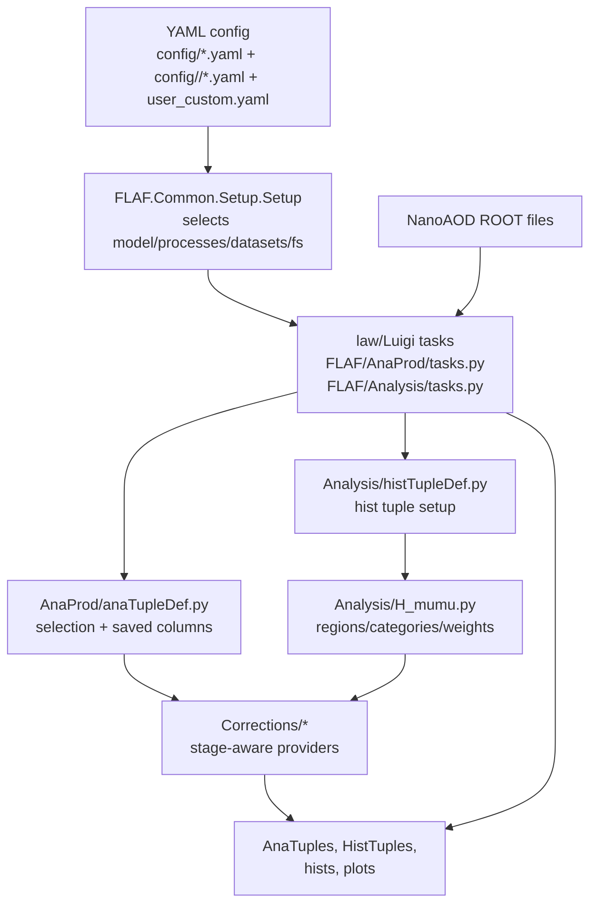

# H_mumu Dev Wiki

This wiki is for contributors who know HEP, Python, NumPy-style array work, and NanoAOD, but want a code-level map of this repository.

Start here:

1. [Architecture](architecture.md): big picture, data flow, entry points.
2. [Local Workflow](workflow.md): how `law`/Luigi drives tasks and files.
3. [Corrections](corrections.md): how scale factors, shape variations, and weights enter.
4. [Code Style](code-style.md): repo conventions that are not obvious from comments.
5. [Tutorials](tutorials.md): guided traces through real variables and corrections.

## One-Screen Map



## Main Idea

The event loop is not in the law task classes. Law builds the dependency graph, splits work into branches, localizes inputs, and launches producer scripts.

The event loop lives in ROOT `RDataFrame` pipelines. Most analysis code builds lazy column expressions with `Define`, `Redefine`, and `Filter`, then materializes with `Snapshot`.

The top-level analysis code is small because most framework machinery lives in two submodules:

- `FLAF`: workflow, config loading, common RDataFrame helpers, plotting.
- `Corrections`: scale factors, object variations, weights, calibration data.

## First Commands

```sh
source env.sh
law index --verbose
uv run python3 tests/test_setup_loading.py
```

For a first workflow inspection, prefer status and narrowed selections before production runs:

```sh
law run InputFileTask --period Run3_2022 --version dev --print-status 2,0
law run HistPlotTask --period Run3_2022 --version dev --dataset GluGluHto2Mu --test 100 --workflow local --print-status 3,1
```

`--period`, `--version`, `--dataset`, `--process`, `--model`, `--customisations`, and `--test` are inherited from the shared `Task` base class.
