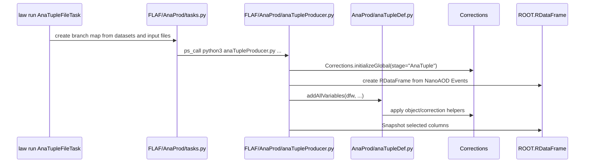
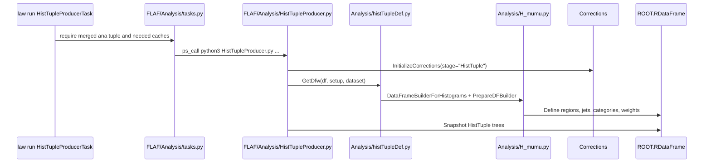

# Architecture

## Layers

H_mumu is an analysis package on top of FLAF and Corrections.

| Layer | Files | Job |
| --- | --- | --- |
| Analysis configuration | `config/global.yaml`, `config/<period>/*.yaml`, `config/user_custom.yaml` | Select eras, physics model, processes, datasets, corrections, regions, categories, variables, output file systems. |
| Workflow engine | `FLAF/AnaProd/tasks.py`, `FLAF/Analysis/tasks.py`, `FLAF/run_tools/law_customizations.py` | Build law/Luigi task graph, split branches, decide dependencies, localize inputs, launch producer scripts. |
| Event transformations | `AnaProd/anaTupleDef.py`, `AnaProd/baseline.py`, `Analysis/histTupleDef.py`, `Analysis/H_mumu.py` | Define RDataFrame columns, event selections, categories, weights, histogram inputs. |
| Corrections | `Corrections/Corrections.py`, `Corrections/*.py`, `Corrections/data/*` | Instantiate correction providers by stage, apply p4 variations, IDs, scale factors, trigger weights, PU, JEC/JER, muon scale/resolution. |
| C++ helpers | `include/*.h`, `include/*.cc`, `FLAF/include/*.h` | Fast helper functions declared into ROOT's interpreter and called from RDataFrame expressions. |
| ML payloads | `Analysis/*_Application.py`, `Analysis/*_models/*` | Optional cache producers for DNN/VBFNet/PostVBFNet payload columns. |

## Data Flow

```mermaid
flowchart LR
    A["InputFileTask\nlist NanoAOD files"] --> B["AnaTupleFileTask\nNanoAOD -> raw ana tuple"]
    B --> C["FuseAnaTuples.py\nfuse raw outputs"]
    C --> D["AnaTupleFileListTask\nmerge plan + reports"]
    D --> E["AnaTupleMergeTask\nmerged ana tuples"]
    E --> F["HistTupleProducerTask\nanalysis columns + binned columns"]
    F --> G["HistFromNtupleProducerTask\nper-variable hist files"]
    G --> H["HistMergerTask\nmerged hists"]
    H --> I["HistPlotTask\nPDF plots"]

    E --> J["AnalysisCacheTask\noptional payload producers"]
    J --> F
    J --> K["AnalysisCacheAggregationTask\noptional aggregate cache"]
    K --> F
```

Each box is a law task except the producer scripts. The law task owns orchestration; the producer script owns event math.

## Runtime Call Stack

For ana tuple production:

For histogram tuple production:

## Setup And Config Loading

`Setup` is the central object. Every law task gets one through `Task.__init__`.

Path order:

1. `FLAF/config`
2. `FLAF/config/<period>`
3. `config`
4. `config/<period>`

For each path, `Setup.Config` reads matching files such as `global.yaml` and `user_custom.yaml`. Later YAML keys override earlier keys. This is why H_mumu can override FLAF defaults, and period configs can override global analysis defaults.

`Setup` then builds:

- `global_params`: merged global settings.
- `phys_model`: selected model from `phys_models.yaml`.
- `base_processes` and `parent_processes`: expanded process tree from `processes.yaml`.
- `datasets`: active datasets from `datasets.yaml`, filtered by `--model`, `--process`, and `--dataset`.
- `weights_config`: period-aware weight systematics from `weights.yaml`.
- `var_producer_map`: maps cache variables like `DNN_NNOutput` to payload producers like `DNN`.
- file systems: local paths or WLCG file systems from `fs_*` config keys.

## Main Entry Points

| Need | Start Here |
| --- | --- |
| Environment | `env.sh`, then `FLAF/env.sh` |
| Law task graph | `FLAF/AnaProd/tasks.py`, `FLAF/Analysis/tasks.py` |
| Shared task parameters and output paths | `FLAF/run_tools/law_customizations.py` |
| Config loading and model/dataset selection | `FLAF/Common/Setup.py` |
| NanoAOD -> ana tuple columns | `AnaProd/anaTupleDef.py` |
| H_mumu baseline event selection | `AnaProd/baseline.py` |
| Hist tuple analysis columns | `Analysis/histTupleDef.py`, `Analysis/H_mumu.py` |
| Corrections singleton and provider selection | `Corrections/Corrections.py` |
| Systematic naming | `Corrections/CorrectionsCore.py` |
| ML payload producers | `Analysis/DNN_Application.py`, `Analysis/VBFNet_Application.py`, `Analysis/PostVBFNetDNN_Application.py` |

## NumPy Mental Model

Think of `RDataFrame` as a lazy array DAG:

- `Define("x", "expr")`: add a lazily computed column.
- `Redefine("x", "expr")`: replace a column definition.
- `Filter("cut", "name")`: add a lazy row mask.
- `Snapshot(...)`: materialize selected columns into a ROOT tree.
- `Report()`: materialize filter counts.

The code builds symbolic expressions as strings because ROOT JIT-compiles them. That is why many performance-sensitive pieces live as C++ helpers in `include/` or `FLAF/include/`.
