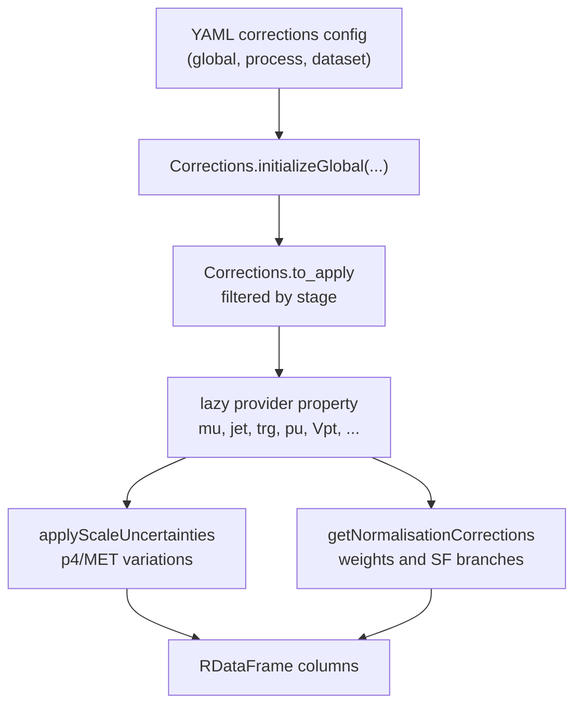

# Corrections

## Mental Model

Corrections are stage-aware providers behind one singleton: `Corrections.getGlobal()`.

The singleton is initialized once per producer script with:

- `setup`
- `stage`
- `dataset_name`
- selected dataset/process config
- processor instances
- data/MC flag
- trigger dictionary

Then analysis code calls lazy provider properties such as `corrections.mu`, `corrections.jet`, `corrections.muScaRe`, `corrections.trg`, and `corrections.Vpt`.

## Lifecycle



## Stage Selection

Correction config can use either `stage: AnaTuple` or `stages: [AnaTuple, HistTuple]`.

`Corrections.__init__` checks dataset config first, then process config, then global config. First definition wins; later duplicates are skipped with a warning. That gives precedence to dataset-specific corrections, then process-specific corrections, then global defaults.

Current global H_mumu defaults in `config/global.yaml`:

| Correction | Stage(s) | Main Use |
| --- | --- | --- |
| `btag` | `AnaTuple`, `AnalysisCache`, `HistTuple` | b-tag WP and optional SF modes. Current H_mumu mode is `none` in all stages. |
| `mu` | `AnaTuple` | muon ID/iso scale factors and selected muon columns. |
| `trigger` | `AnaTuple` | trigger scale factors. |
| `muScaRe` | `AnaTuple` | muon scale/resolution and FSR recovery. |
| `lumi` | `AnaTuple` | luminosity weight. |
| `xs` | `AnaTuple` | cross section weight. |
| `gen` | `AnaTuple` | generator weight sign or value. |
| `pu` | `AnaTuple`, `AnaTupleMerge` | pileup weights and PU shape variations. |
| `base` | `AnaTupleMerge` | base weight using denominator/cross section/lumi/gen. |
| `JEC` | `AnaTuple` | jet energy corrections and JES variations. |
| `JER` | `AnaTuple` | jet energy resolution and jet horns fix. |

Process config can add corrections. Example: DY process entries add `Vpt`, often for `AnalysisCache` and `HistTuple`.

## Shape Versus Normalisation

Shape corrections change object four-vectors or event kinematics.

Main path:

```text
Corrections.applyScaleUncertainties(df, ana_reco_objects)
```

It creates systematic p4 columns such as `Jet_p4_JES_TotalUp`, `Muon_p4_ScaReDown`, and related MET columns. It returns `syst_dict`, mapping systematic names to `(source, scale)`.

Normalisation corrections create weight branches.

Main path:

```text
Corrections.getNormalisationCorrections(...)
```

It can define lumi, cross section, gen, PU, base, Vpt, tau, btag, muon, electron, puJetID, trigger, and fatjet weights. The returned branch list is appended to saved columns.

## Where Corrections Enter

Ana tuple stage:

1. `FLAF/AnaProd/anaTupleProducer.py` initializes corrections with `stage="AnaTuple"`.
2. It calls `corrections.applyScaleUncertainties`.
3. It calls `AnaProd/anaTupleDef.py::addAllVariables`.
4. `addAllVariables` calls providers such as:
   - `Corrections.getGlobal().jet.getEnergyResolution`
   - `Corrections.getGlobal().btag.getWPid`
   - `Corrections.getGlobal().JetVetoMap.GetJetVetoMap`
5. For MC, `anaTupleProducer.py` calls `getNormalisationCorrections` and saves weight branches.

Hist tuple stage:

1. `FLAF/Analysis/HistTupleProducer.py` calls `Utilities.InitializeCorrections(..., stage="HistTuple")`.
2. `Analysis/histTupleDef.py::GetDfw` builds `DataFrameBuilderForHistograms`.
3. `Analysis/H_mumu.py::PrepareDFBuilder` defines physics variables, regions, categories, and jets.
4. `Analysis/histTupleDef.py::DefineWeightForHistograms` calls `getNormalisationCorrections` when needed and defines final histogram weights.

Analysis cache stage:

1. `FLAF/Analysis/AnalysisCacheProducer.py` calls `Utilities.InitializeCorrections(..., stage="AnalysisCache")`.
2. It runs the configured payload producer from `config/global.yaml::payload_producers`.
3. Cache files can be friend trees during hist tuple production.

## Provider Map

| Provider | File | Typical Branches Or Effects |
| --- | --- | --- |
| `pu` | `Corrections/pu.py` | `weight_pu_*` |
| `mu` | `Corrections/mu.py` | muon ID/iso SF branches |
| `muScaRe` | `Corrections/MuonEnergyScale_corr.py` | corrected muon p4, ScaRe variations, FSR recovery |
| `trg` | `Corrections/triggersRun3.py` or `Corrections/triggers.py` | trigger SF or efficiency branches |
| `jet` | `Corrections/jet.py` | JEC/JER variations, jet energy resolution |
| `btag` | `Corrections/btag.py` | WP IDs, shape/WP scale factors when enabled |
| `Vpt` | `Corrections/Vpt.py` | DY/EWK/Vpt weights |
| `JetVetoMap` | `Corrections/JetVetoMap.py` | jet veto map columns and filters |
| `met` | `Corrections/met.py` | MET variations from object shifts |
| `xs_db` | `FLAF/Common/CrossSectionDB.py` | cross section lookup |

## Denominators And Stitching

Some process entries define processors in `config/processes.yaml`, such as `FLAF.Processors.MCStitching.MCStitcher`.

These processors provide hooks:

- `onAnaCache_initializeDenomEntry`
- `onAnaCache_updateDenomEntry`
- `onAnaTuple_defineCrossSection`
- `onAnaTuple_defineDenominator`

This is how inclusive plus binned samples can get stitched denominators and cross section behavior without hard-coding it in H_mumu analysis code.

## Add Or Fix A Correction

1. Decide the stage: `AnaTuple`, `AnaTupleMerge`, `AnalysisCache`, or `HistTuple`.
2. Decide if it is shape, normalisation, or both.
3. Add or edit YAML under `config/global.yaml`, `config/<period>/*.yaml`, or a process/dataset entry.
4. If a new provider is needed, add it under `Corrections/` and expose it through a lazy property in `Corrections/Corrections.py`.
5. Add the provider call at the stage boundary:
   - object variations: `applyScaleUncertainties`
   - saved columns/selections: `AnaProd/anaTupleDef.py`
   - histogram weights: `Analysis/histTupleDef.py`
   - analysis variables/categories: `Analysis/H_mumu.py`
6. Run the smallest setup or workflow check that exercises the stage.

Debug tip: producer logs print `Corrections to apply: ...`. If your correction is missing there, the YAML stage selection or config precedence is wrong.
